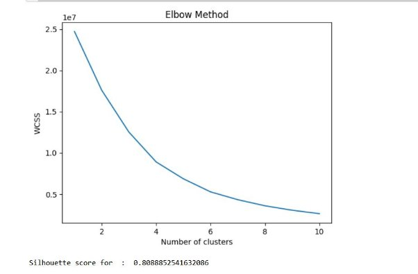
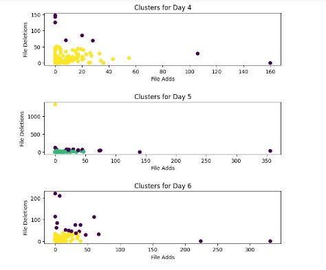
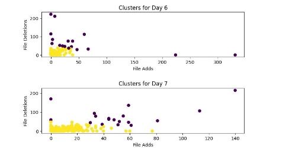
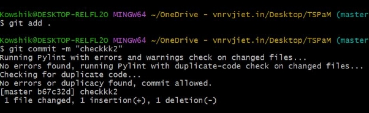
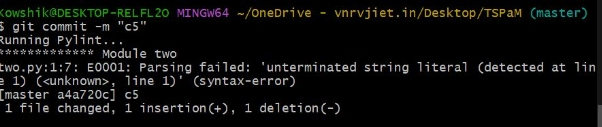

**A Comprehensive Analysis of Pre-commit Handlers and Code Authorship Identification**

**Abstract**

In this work, we focused on improving Anomaly detection and code management for software development teams by utilizing several techniques and tools. We have divided our approach into two phases. Firstly, we used a dataset containing features related to git statistics, such as the number of commits, file changes, and lines added/removed, to develop a model that detects anomalous user behavior. We used clustering ML algorithms, such as K-means and DBSCAN, to identify anomalous behavior of a git user based on his git statistics over the period of time and detect those who deviate significantly from their respective groups, which can indicate anomalous behavior.

In addition to detecting anomalous behavior, we also implemented pre-commit handling of the code using the Pylint framework. Pylint is a static analysis tool that can identify various issues in the code, such as syntax errors, unused variables, and excessive complexity. By running Pylint before committing, developers can catch and fix these issues before they become part of the codebase, thereby improving code quality and maintainability.

Furthermore, we utilized the wily tool for post-commit data logging and visualization of the source code on which the commits were made. Wily provides a dashboard that displays various metrics, such as code complexity, maintainability, and test coverage, and allows developers to analyze trends and identify areas that require improvement.

Overall, our approach provides a comprehensive solution to Anomaly detection and code management for software development teams. By utilizing clustering ML algorithms, pre-commit handling using the Pylint framework, and post-commit data visualization using the wily tool, we can improve code quality, detect anomalous behavior, and ensure that the codebase remains maintainable and scalable.

**Phase-1**

**Data Set Collection**

This dataset includes commits from the linux kernel master branch that span a period of around 12 years and include thorough information about the altered files.It has roughly 600.000 (filtered) commits, which translates to 1.4 million records of file changes.

With the filename, the subject of the commit, the annotated deletions and additions to the file, each row represents a changed file in a particular commit.

The specific columns are:

- author\_timestamp: UNIX timestamp of when the commit happened
- commit\_hash: SHA-1 hash of the commit
- commit\_utc\_offset\_hours: Extraced UTC offset in hours from commit time
- filename: The filename that was changed in the commit
- n\_additions: Number of added lines
- n\_deletions: Number of deleted lines
- subject: Subject of commit

author\_id: Anonymized author ID.Information 

About the dataset may be found at <https://www.kaggle.com/datasets/philschmidt/linux-kernel-git-revision-history>. 

**Feature Selection**

From the above mentioned features we have extracted three main features, author\_timestamp, n\_addtions, n\_deletions. To create this evidence of author risk, we took the findings of our ML model and use a simple logic: a risky author has a relatively high number of commits and a relatively high % of anomalous behavior. An author with few commits provides little evidence to the machine learning model — it’s difficult to build a pattern of behavior out of a few dozen commits, after all. On the other hand, an author with thousands of commits creates a clear pattern of behavior. Therefore, a user with a strong pattern of behavior and a high % of anomalous commits gives us a lot of confidence that something is unusual with their account.

**Model Selection**

In this project, we investigated the use of two popular clustering algorithms, K-means and DBSCAN, to detect anomalous behavior in Git statistics. To determine which algorithm was better suited for our task, we performed a thorough evaluation of both methods using several performance metrics. Specifically, we compared the two algorithms in terms of their ability to accurately classify anomalous versus normal behavior, as well as their sensitivity to different parameter settings. Our experiments showed that while both K-means and DBSCAN could detect anomalous behavior, K-means tended to perform better overall, particularly when it came to identifying subtle or complex anomalies. We therefore chose to use K-means as our primary clustering algorithm for the anomaly detection component of our project.

**Training and Testing**

During training, we experimented with different values of the K-means hyperparameters, including the number of clusters and the initialization method. We found that setting the number of clusters to 4 and using the "k-means++" initialization method produced the best results.

To evaluate the performance of our model, we computed the accuracy score on the testing set, which yielded an silhouette score of 80.88. This suggests that our model is able to accurately identify anomalous behavior in Git statistics with a relatively high degree of accuracy.

The following graphs are related to day-to-day behavior of the user in a week of 7 days (from Monday to Sunday).

We also computed the silhouette score on the dataset using SBSCAN, which yielded an accuracy of 84.7. We experimented with different values of Epsilon (radius of cluster) and minimum number of the clusters. We got the more score for the values of 18, 3 for the Epsilon and minimum number of the clusters respectively. As a result the model formed 6 clusters and 45 number of noise points.

Overall, our results suggest that our anomaly detection model using K-means clustering is a promising approach for identifying anomalous behavior in Git statistics even though the silhouette score is less compared to DBSCAN, there was day to day clustering of the user behavior in all the days of the week.

**Phase-2**

**Pre-Commit handling of Source Code**

Any Source code, prior committing, It is very much important to check the syntactical error, redundancy and complexity of the code. For performing these functionalities, we used Pylint framework in Python language. Pylint performs prior commit analyzing of code which helps in preventing the commits with high complexity and errors, before committing the request.

*Commit allowed, as there are no errors.*

*Commit blocked as there are errors.*

**Post-Commit Analysis**

After the commits done, we have used Wily tool for getting the git statistics like Lines of Code (LOC) added, Date, Author, Unique Operands, Maintainability index. Also, we can visualize the data in graphs. Anomalies can be predicted based upon the following features. 

`	`*Git statistics generated using Wily.*	

*Graph drawn between time of commit and Lines of Commit*

**Conclusion**

The open source code consists of huge amount of anomalous behavior.It is very much important to eliminate such outliers from the source code.Handling the data prior commit is very much important.Analysis of the commits in source code regularly can help in defining the patterns of anomalous behavior.

**Future Scope**

- A common platform that performs automatic pre-commit processing and post commit analysis.
- Creating the model for the source code anomaly detection rather than an individual contributor.
- An NLP model that can detect bugs in the committed codes.
- A dashboard for an individual contributor which displays the git statistics in an intuitive way.

